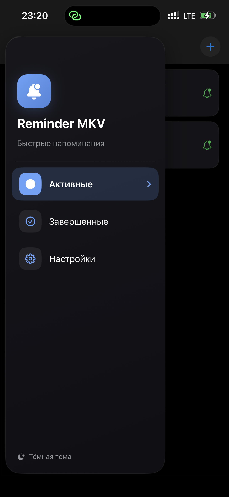
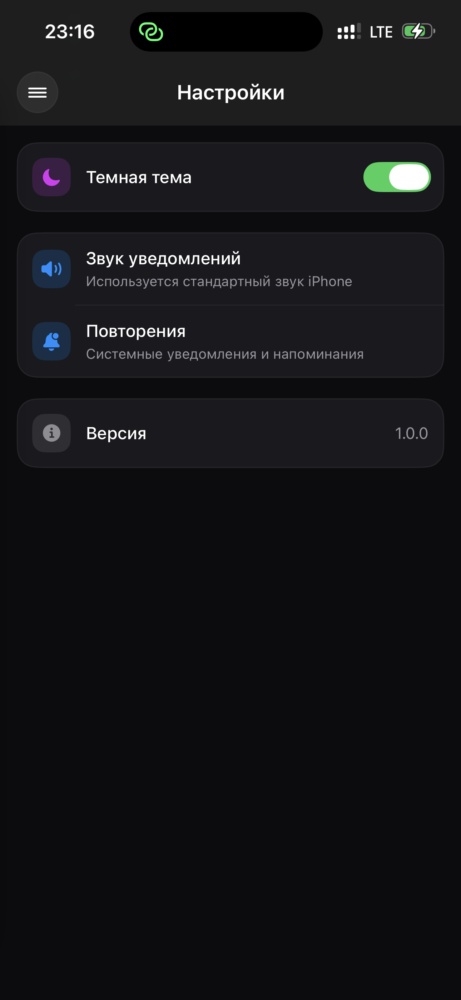

# Reminder-MKV
Reminder MKV - самая простая напоминалка без заморочек

Мое первое iOS-приложение, созданное на Swift / SwiftUI.

## О проекте
Это приложение помогает не пропустить запланированные задачи.
Для установки потребуется esign и сертификат, в ближайшем будущем мы решим этот вопрос.

## Функции
- Основной экран
- Активные, Завершенные задачи
- Push-уведомления
- Темная тема

## Технологии
- Swift
- SwiftUI
- Xcode
- iOS
 
## Скриншоты

  
  
  
  

## Статус
Проект в разработке.

## Планы
- улучшить UI
- добавить анимации
- подготовить релиз в App Store

## Автор
mkv.tb
